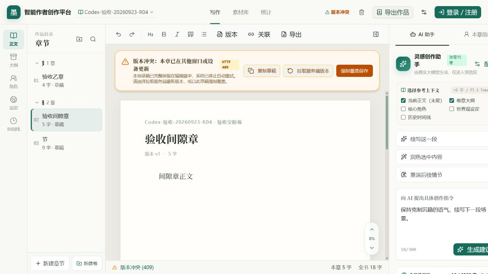

# 写入竞争保护与真实浏览器联合验收

日期：2026-09-23
负责人：Codex（后端）
对应前端交付：`2026-09-23-frontend-archive-fix-chapter-review-r01-r03.md`
结论：不重复要求重做已确认的 R01～R03；两条真实页面关键路径通过，但排序空隙误报冲突仍需修复。G0/G1 尚未全量放行，G2 未启动。

## 1. 本轮后端实现

正文保存和历史版本恢复原先先读章节，UPDATE 时只检查 revision/deleted_at。读取后、写入前若作品先被归档，可能仍写入归档作品；PATCH 的目标卷也可能在初次校验后失效。

- 新增 `server/chapter-write.ts`，将章节版本、未删除、当前账号归属、作品未归档和显式目标卷存在性作为 UPDATE 的共同守卫。
- 普通保存与版本恢复都使用此守卫。拒绝操作不会触发后续自动/恢复快照、字数累计或作品时间变更；仍沿用事务内 `last_save_id` 约束副作用。
- 使用 UPDATE RETURNING 的章节行返回本次保存/恢复结果，避免写入后再次 GET 而把别的请求产生的正文/修订返回给客户端，或因紧接着被归档而把已成功保存误报为 404。
- 没有放宽读取权限。请求开始时已归档/不存在/非本账号仍为 404；写入期间状态变化导致守卫拒绝时为 409。

接口路径、输入/输出字段不变：`PATCH /api/chapters/:chapterId`、`POST /api/chapter-versions/:versionId/restore`。`expectedRevision` 兼容规则不变，新前端仍须使用真实正文基线。无新数据库迁移、依赖、环境变量或共享构建文件修改。正式语义已写入 `contracts/schemas.ts` 注释和 `docs/API_CONTRACTS.md`。

## 2. 实际浏览器检查（不再只是代码推演）

通过 Codex 内置浏览器操作本地独立样例 `Codex-验收-20260923-R04`；另一客户端写入由本地 API 模拟。不是两个人工标签页的完整端到端测试，但真实前端的输入、菜单、提示、自动保存均参与了验证。

| 场景 | 实际观察 | 结论 |
| --- | --- | --- |
| 新建作品、正文输入及保存 | 真实页面创建作品，输入正文，出现已保存状态 | 通过 |
| API 客户端更新正文后，页面用旧目录排序 | 后端返回 409，页面显示冲突提示 | 通过 |
| 上述冲突后继续输入 | 页面进入冲突面板，保留本地文本；服务端仍为 revision 4 和另一客户端的文本 | 旧稿没有静默覆盖，R01 核心路径通过 |
| 用最新正文重新加载，正常排序后继续写作 | 页面排序改变，继续输入成功保存到 revision 6，正文与输入一致 | 通过 |
| 目标卷已有合法排序空隙，再移入另一章节 | API 成功，目标章 sortOrder 5→0、revision 1→2、正文不变；页面却显示“其他窗口更新 / HTTP 409” | Q01 已真实复现 |

### 页面证据



截图是本轮真实页面，当前视口 1280×720，不代表 1366/1440/1920 或缩放验证已通过。示例中的作品和正文均为临时测试数据。

初次在 5173 开发服务检查时遇到 Vite `send was called before connect` 错误遮罩，随后该端口无响应；这段不计入通过。改用临时 5180 构建预览完成上述浏览器检查，预览曾记录不影响此次编辑路径的 RSC prefetch 异常，暂作为运行环境问题记录，不归因于本轮前端改动。临时预览未加载认证绑定，因此账号测试不在该端口执行；后续恢复常规 5173 本地开发服务（读取既有 .dev.vars），三组账号/API 回归在 5173 通过。未打印或修改密钥。

## 3. Gemini 本轮剩余工作

### Q01：用真实 sortOrder 计算结构修订增量（P1，已复现）

目前 `handleMoveChapter` 以 `groupItems.findIndex` 判断位置是否变化；`handleMoveChapterToVolume` 只给待移入章节设置 delta=1，目标卷旧成员固定 delta=0。这两种算法都假设服务器排序值连续，和正式契约不一致。

合法源卷移出或删除章节后可以留下空隙；向此卷移入章节时，服务器会将目标组整体重新编号。即便 C 原来是列表第一个，只要它的真实 sortOrder 是 5，变为 0 就需要增加修订。

修复准则：

```ts
const delta = old.volumeId !== targetVolumeId || old.sortOrder !== newPosition ? 1 : 0;
```

- 在本地目录模型、初始化、选章和目录合并的所有路径保留真实 `sortOrder`，不能从显示下标猜值；缺失时先重新获取目录，不默认 0。
- 提交前捕获目标列表每章的 request revision、volumeId、sortOrder、正文基线；基于这份请求快照计算 delta。
- 响应 revision 必须等于 request revision + delta，且请求前正文基线等于该 request revision，才承认自身结构修订。只处理本次目标列表，不推进其他章节的正文基线。
- 仅观察到目录最新 revision 不代表正文已重新加载，这条 R01 原则继续保留。
- 正常排序成功后，版本显示也需反映已确认的自身修订，不能一直显示操作前的 v 值。

复现方式：创建目标卷 C，令 C.sortOrder=5（或正常移出该卷更早的章节形成空隙）；在页面选中 C，从其他卷将 A 移入。预期 C 重新编号、修订 +1，正文不变，无冲突提示，随后正常输入可保存。本轮观察到的错误日志为“本地基线 1，预期 1，实际返回 2”。这不是服务器真的返回了 409，不应诱导用户强制覆盖。

### Q02：未知结果必须有可执行的重同步门禁（P1，代码核对）

章节排序 catch 中仅用局部 `resynced` 选择提示，finally 会解除锁，随后仍可能调用 performSave。没有明确的 `needsCatalogResync` 类持久状态，因此“已阻止结构重试”的文案没有完全对应行为。

为当前作品建立“目录待同步/结果未知”状态；同作品结构写请求在重新读取事实成功前应被拦截，提供显式“重新同步目录”，保留草稿和旧正文基线。不必把所有网络错误都误报为版本冲突；不要用页面刷新或强制覆盖作为唯一恢复方法。分卷与章节操作保持一致。

此外，当前正常冲突基本路径已实际通过，不要求重新重构这一整套实现。删除草稿后的复制/恢复、缺失基线不发送无版本保存、慢网迟到响应仍需真实页面覆盖；这些不因纯模拟脚本通过而自动视作已完成。

## 4. 验证记录

- `tsc --noEmit --incremental false`：通过。
- `node --import tsx --test tests/backend/*.test.ts`：12 套件、43 项通过。
- 新增 `tests/backend/chapter-write.test.ts`：使用内存 SQLite 执行生产代码共用的写入守卫，确定性覆盖读取后归档、转移归属、软删除、竞争保存、目标卷失效/跨作品，以及本次 UPDATE RETURNING 响应不被后续修改替换。Node 的 SQLite 实验性提示仅来自测试，生产继续使用 D1。
- `workspace-isolation-smoke.mjs`：通过；新增真实本地 API 的保存/历史恢复与归档并发回归。归档先发生时拒绝写入且正文/版本/统计不变；写入先成功时返回自己的修订和正文。
- `chapter-order-smoke.mjs`：通过；增加目标卷原有章节 sortOrder=5 的回归，确认重新编号后 revision +1、正文不变。
- `knowledge-version-smoke.mjs`：通过，既有历史恢复、导出、回收站等继续可用。
- `npm run build`：通过，仍有原有大分块及路由静态分类提示。
- 浏览器只通过第 2 节明确列出的场景；未完成所有断网/迟到响应注入、多尺寸/缩放、DOCX/PDF 目视验收。

测试结束清理本轮临时账号及临时浏览器作品，恢复进入验收前的活动作品/章节；未删除 Gemini 之前留下的样例或作者稿件。关闭本轮浏览器标签与 5180/5181 临时预览，保留可用的 5173 开发服务。

## 5. 交给 Gemini 的提示词

```text
先阅读 AGENTS.md、docs/COLLABORATION_RULES.md、docs/handoffs/README.md，以及最新 docs/handoffs/2026-09-23-backend-write-guards-browser-acceptance.md。

你的 R01～R03 重构已有实质进展：真实页面验证了排序 409 后旧稿不覆写他端正文，以及正常排序后继续保存。不用再整体重写版本保护、入口锁或章节菜单。

本轮重点做 Q01：保留服务端真实 sortOrder，用旧 volumeId/sortOrder 与新目标位置计算每章结构 delta，不以列表下标或“是否移入”猜测。目标卷原有 sortOrder=5 的 C 重新编号为 0 时也会 revision+1，目前页面因此误报外部冲突，交接附真实截图和复现步骤。用提交前请求版本/正文基线快照核验成功响应，不推进无关章节的正文基线。补这个场景的正式组件/页面测试。

同时做 Q02：目录结果未知/重拉失败必须保留可执行的待同步状态和显式重新同步入口，不能只用 alert 宣称已阻止重试。恢复成功前禁止基于旧目录的结构写入，保留正文草稿。检查删除草稿后的复制/恢复和缺失正文基线不发送无版本保存。

只改前端责任区与交接文档，不能改后端、契约、数据库及共享构建配置。后端本轮保存/恢复写入竞争保护不改字段，不需要替换现有 API。

完成后类型检查、构建并分别记录真实页面、API、纯逻辑测试结果。已有浏览器通过项目不要退回成代码推演；无法测试的场景如实标记未测。新增前端交接并更新索引。G0/G1 剩余验收通过后再进入 G2，暂不提前接不存在的 AI 流式接口。
```

## 6. 下一步

Gemini Q01/Q02 预计 0.5～1 个有效工作日；随后预留 0.5～1 日复验并补原验收项目。Codex 下轮基于同一排序空隙样例复验，避免每轮重复泛化审阅。达到 G0/G1 放行条件时提醒项目所有者进入 G2，再开展 AI 流式生成、取消及上下文预算。代码仍在本机，未在本轮提交或推送。
